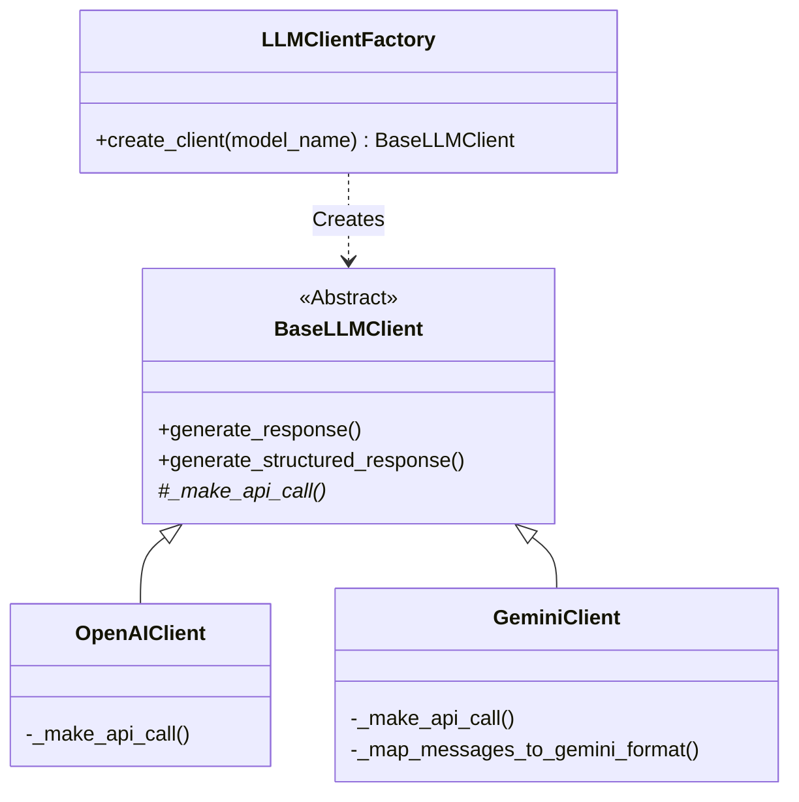
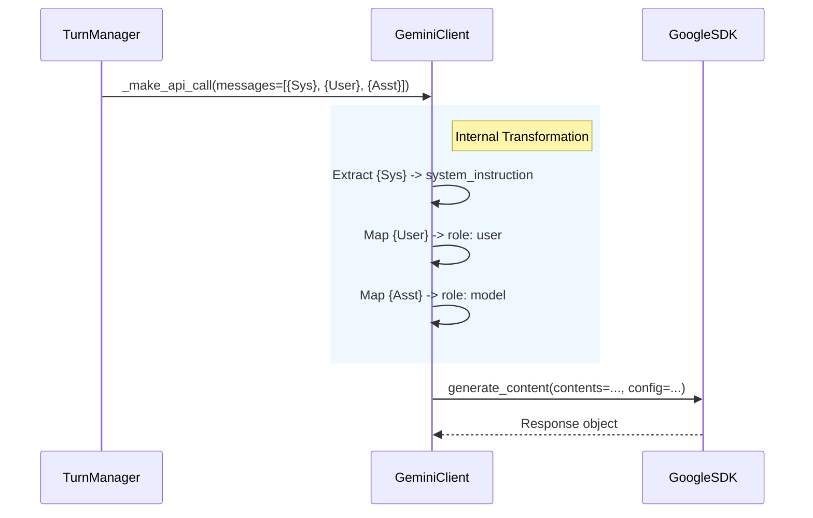

# Design Document: Gemini Integration

**Feature Name**: Google Gemini Provider Support
**Version**: 1.0
**Author**: Spec-Driven Design Expert
**Related Documents**: [Requirements: Add Multi-Provider Support] (Implied)

## Overview

This design details the integration of the Google Gen AI SDK into the existing `spyfall-arena` architecture. By extending the existing `BaseLLMClient` strategy pattern, we will enable the system to utilize Gemini models (e.g., `gemini-2.5-flash`) alongside the existing OpenRouter/OpenAI implementation.

### Design Goals

1.  **Seamless Integration**: Support Gemini models without changing the core game logic (`TurnManager`, `GameOrchestrator`).
2.  **Protocol Translation**: Automatically convert standard OpenAI-style message history (System/User/Assistant) into Gemini's specific `Content` and `SystemInstruction` format.
3.  **Structured Output**: Leverage Gemini's native JSON mode to ensure game stability.

### Key Design Decisions

1.  **Strategy Pattern**: We will implement `GeminiClient` as a concrete implementation of `BaseLLMClient`.
2.  **Heuristic Detection**: Rather than adding a complex `provider` field to the configuration YAML, the `LLMClientFactory` will detect Gemini models based on the string prefix (e.g., starts with `gemini`).
3.  **Key Management**: Extend `ApiKeyManager` to handle `GOOGLE_API_KEY` distinct from `OPENROUTER_API_KEY`.

## Architecture

### System Context

The `GameOrchestrator` requests an LLM client from the Factory. The Factory determines which provider to instantiate based on the configuration.



### Technology Stack

| Layer | Technology | Rationale |
|-------|------------|-----------|
| **SDK** | `google-genai` | Official Python SDK for Gemini v1beta/v1 APIs. |
| **Auth** | `keyring` / `yaml` | Existing pattern for secure key storage. |
| **Parsing** | `json` standard lib | Gemini returns JSON strings that need parsing. |

## Components and Interfaces

### Component 1: `GeminiClient`

**Purpose**: Adapts the generic `BaseLLMClient` interface to the specific requirements of the Google Gen AI SDK.

**Responsibilities**:

1.  **Message Translation**: Iterate through the generic `messages` list. Extract `role: system` messages to populate `config.system_instruction`. Map `role: assistant` to `role: model`.
2.  **Config Construction**: Build `types.GenerateContentConfig` handling temperature and MIME types (for JSON mode).
3.  **Execution**: Call `client.models.generate_content`.

**Interfaces**:

  * **Input**: Inherits standard `messages` list (`[{"role": "user", "content": "..."}]`).
  * **Output**: Returns raw dictionary or parsed JSON matching the `BaseLLMClient` contract.

**Implementation Notes**:

  * *Structured Data*: When `response_format={"type": "json_object"}` is passed, set `response_mime_type="application/json"` in Gemini config.

### Component 2: `ApiKeyManager` (Update)

**Purpose**: Manage retrieval of the Google API key.

**Responsibilities**:

  * Load `google_api_key` from system keyring or `apikeys.yaml`.
  * Provide a specific accessor method `get_google_api_key()`.

### Component 3: `LLMClientFactory` (Update)

**Purpose**: Routing logic for provider selection.

**Logic**:

```python
if model_name.lower().startswith("gemini"):
    return GeminiClient(...)
else:
    return OpenAIClient(...)
```

## Data Flow: Message Translation

Gemini handles system prompts differently than OpenAI. The `GeminiClient` must perform this transformation before the API call:



## Security Considerations

### API Key Storage

  * **Existing Pattern**: The project uses `keyring` with a fallback to `apikeys.yaml`.
  * **Gemini Update**: A new key `google_api_key` will be added. The existing warning mechanism for using YAML files in production will apply to this key as well.

## Error Handling

| Error Category | Google SDK Exception | Strategy |
|----------------|----------------------|----------|
| **Auth Error** | `ValueError` (from SDK) | Allow bubble up, caught by Game Orchestrator. |
| **Blocked Content** | `GenerateContentResponse` (finish\_reason) | Check `finish_reason` in response. If blocked, raise `ValueError("Safety filter triggered")`. |
| **Invalid JSON** | `json.JSONDecodeError` | Catch in `_extract_structured_data` and raise `ValueError` with context. |

## Testing Strategy

### Unit Testing

  * **File**: `tests/llm/test_gemini_client.py`
  * **Mocking**: Use `unittest.mock` to mock `google.genai.Client`.
  * **Scenarios**:
    1.  **Message Mapping**: Verify `system` messages are stripped from contents and moved to config.
    2.  **JSON Mode**: Verify `response_mime_type` is set when requested.
    3.  **Factory Logic**: Verify `gemini-2.5-flash` returns a `GeminiClient` instance.

### Integration Testing

  * **File**: `tests/e2e/gemini_api_test.py` (Manual run only)
  * **Goal**: Verify actual connectivity with Google servers using a real key.

-----

## Migration / Implementation Checklist

1.  [ ] **Dependency**: Add `google-genai` to requirements.
2.  [ ] **Config**: Update `ApiKeyManager` to read `google_api_key`.
3.  [ ] **Core**: Implement `src/llm/gemini_client.py`.
4.  [ ] **Factory**: Update `src/llm/llm_client_factory.py` with routing logic.
5.  [ ] **Tests**: Add unit tests for the new client and factory logic.
6.  [ ] **Config**: Update `config.yaml` in e2e tests to verify Gemini behavior (optional, if key available).
